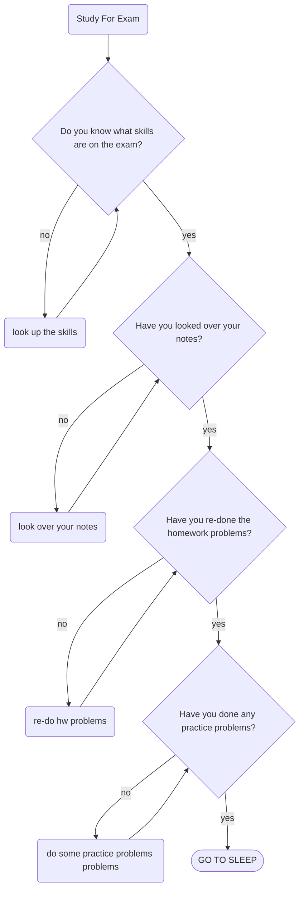

```mermaid
flowchart TD;
    id0(Study For Exam) --> id1{Do you know what skills are on the exam?};
    id1 -- no --> id2(look up the skills);
    id2 --> id1;

    id1 -- yes --> id3{Have you looked over your notes?};
    id3 -- no --> id4(look over your notes);
    id4 --> id3;

    id3 -- yes --> id5{Have you re-done the homework problems?};
    id5 -- no --> id6(re-do hw problems);
    id6 --> id5;

    id5 -- yes --> id7{Have you done any practice problems?};
    id7 -- no --> id8(do some practice problems problems);
    id8 --> id7;

    id7 -- yes --> id9([GO TO SLEEP]);
```
