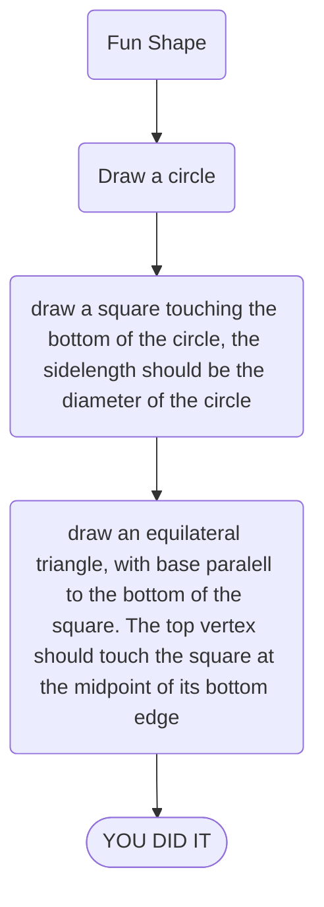
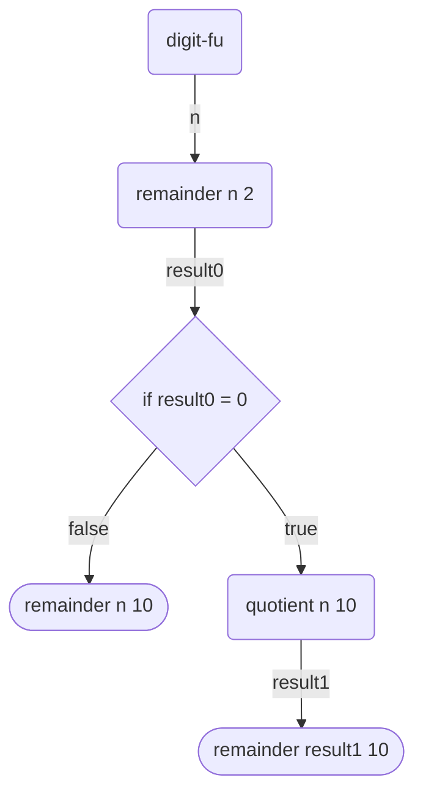

### FC 1

```mermaid
flowchart TD;
    id0(Study For Exam) --> id1{Do you know what skills are on the exam?};
    id1 -- no --> id2(look up the skills);
    id2 --> id1;

    id1 -- yes --> id3{Have you looked over your notes?};
    id3 -- no --> id4(look over your notes);
    id4 --> id3;

    id3 -- yes --> id5{Have you re-done the homework problems?};
    id5 -- no --> id6(re-do hw problems);
    id6 --> id5;

    id5 -- yes --> id7{Have you done any practice problems?};
    id7 -- no --> id8(do some practice problems problems);
    id8 --> id7;

    id7 -- yes --> id9([GO TO SLEEP]);
```

### FC 2

```mermaid
flowchart TD;
    id0(Fun Shape) --> id1(Draw a circle);
    id1 --> id2(draw a square touching the bottom of the circle, the sidelength should be the diameter of the circle);
    id2 --> id3(draw an equilateral triangle, with base paralell to the bottom of the square. The top vertex should touch the square at the midpoint of its bottom edge);
    id3 --> id4([YOU DID IT]);
```

### FC 3

```mermaid
flowchart TD;
    id0(digit-fu) -- n --> id1(remainder n 2);
    id1 -- result0 --> id2{if result0 = 0};
    id2 -- false --> id3([remainder n 10]);
    id2 -- true --> id4(quotient n 10);
    id4 -- result1 --> id5([remainder result1 10]);
```
