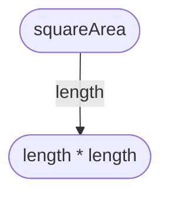
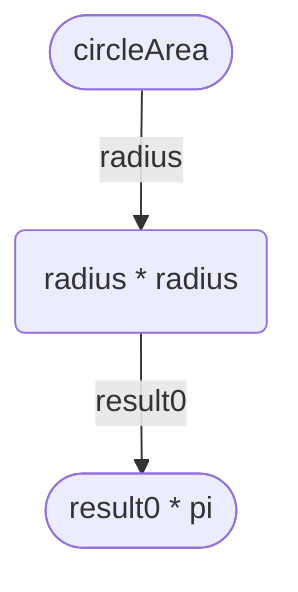
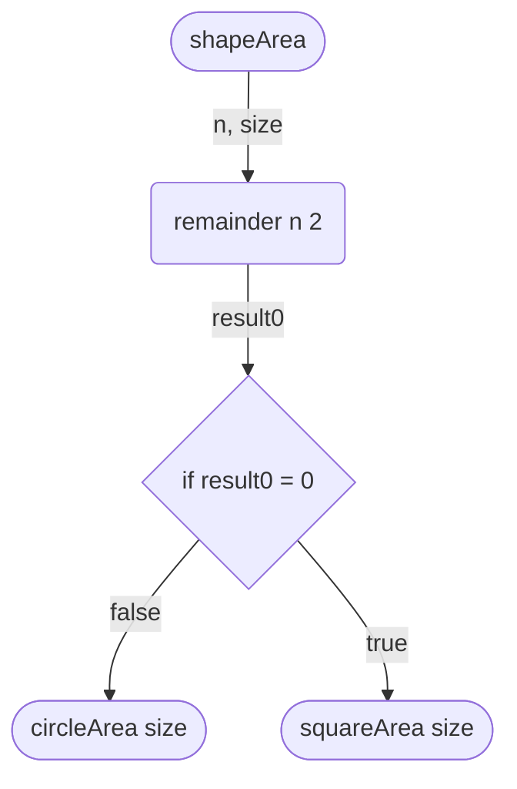
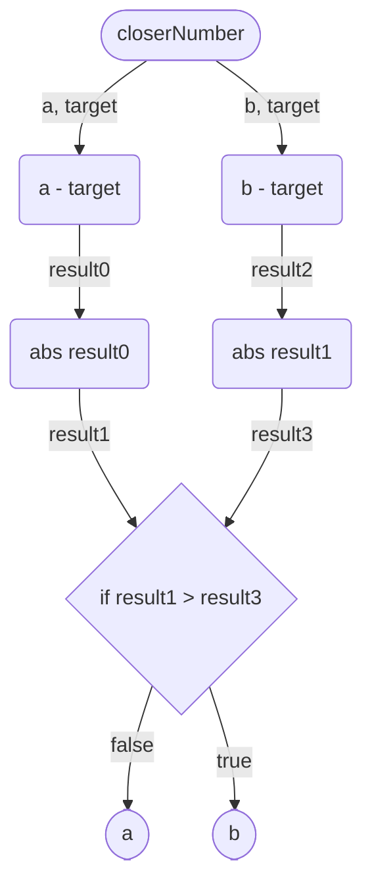

### Square Area

```mermaid
flowchart TD;
    id0([squareArea]) -- length --> id1([length * length]);
```

### Circle Area

```mermaid
flowchart TD;
    id0([circleArea]) -- radius --> id1(radius * radius);
    id1 -- result0 --> id2([result0 * pi]);
```

### Shape Area

```mermaid
flowchart TD;
    id0([shapeArea]) -- n, size --> id1(remainder n 2);
    id1 -- result0 --> id2{if result0 = 0};
    id2 -- false --> id3([circleArea size]);
    id2 -- true --> id4([squareArea size]);
```

### Closer Number

```mermaid
flowchart TD;
    id0([closerNumber]) -- a, target --> id1(a - target);
    id1 -- result0 --> id2(abs result0);
    id2 -- result1 --> id5{if result1 > result3};

    id0 -- b, target --> id3(b - target);
    id3 -- result2 --> id4(abs result1);
    id4 -- result3 --> id5;
    id5 -- false --> id6([a]);
    id5 -- true --> id7([b]);
```
