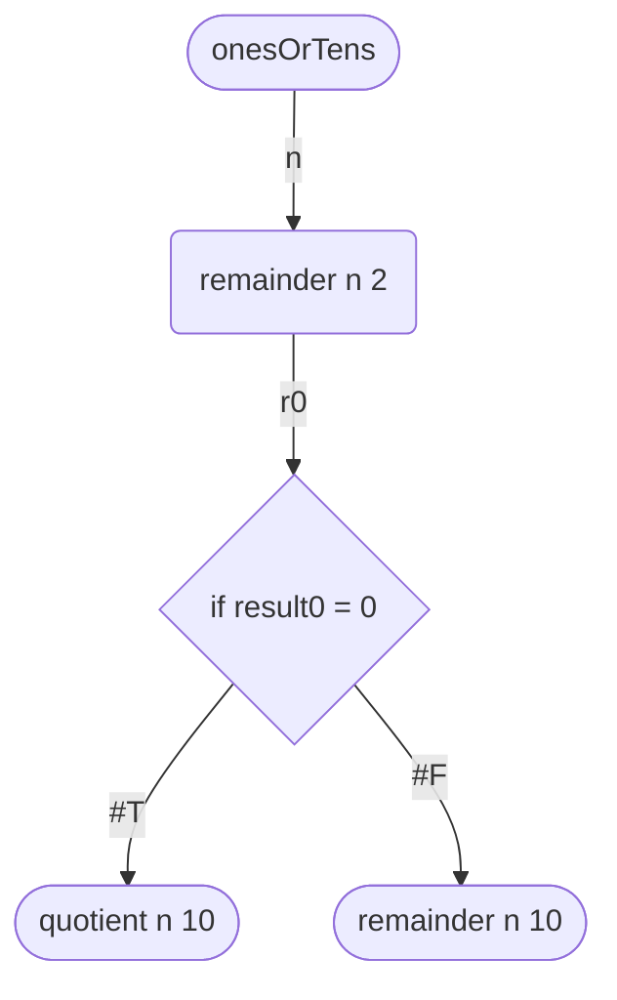
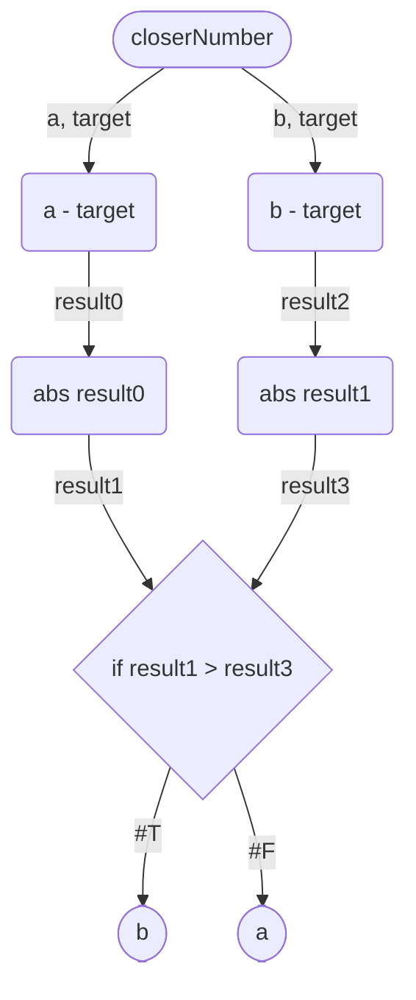
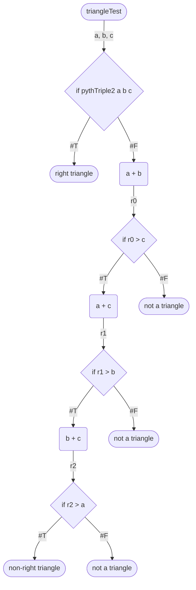

### onesOrTens

```mermaid
flowchart TD;
    id0([onesOrTens]) -- n --> id1(remainder n 2);
    id1 -- r0 --> id2{if result0 = 0};
    id2 -- #T --> id3([quotient n 10]);
    id2 -- #F --> id4([remainder n 10]);
```

### Closer Number

```mermaid
flowchart TD;
    id0([closerNumber]) -- a, target --> id1(a - target);
    id1 -- result0 --> id2(abs result0);
    id2 -- result1 --> id5{if result1 > result3};

    id0 -- b, target --> id3(b - target);
    id3 -- result2 --> id4(abs result1);
    id4 -- result3 --> id5;
    id5 -- #T --> id6([b]);
    id5 -- #F --> id7([a]);

```

### triangleTest

```mermaid
flowchart TD;
  id0([triangleTest]) -- a, b, c --> id1{if pythTriple2 a b c};
  id1 -- #T --> id2(["right triangle"]);
  id1 -- #F --> id3( a + b );
  id3 -- r0 --> id4{if r0 > c };
  id4 -- #T --> id6(a + c);
  id4 -- #F --> id12(["not a triangle"]);
  id6 -- r1 --> id7{if r1 > b};
  id7 -- #T --> id9(b + c);
  id7 -- #F --> id13(["not a triangle"]);
  id9 -- r2 --> id10{if r2 > a};
  id10 -- #T --> id11(["non-right triangle"]);
  id10 -- #F --> id14(["not a triangle"]);
```
