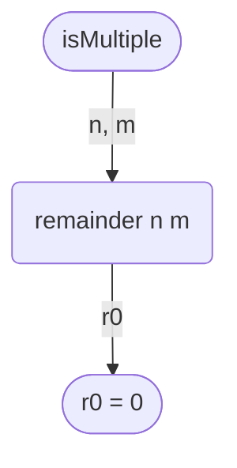
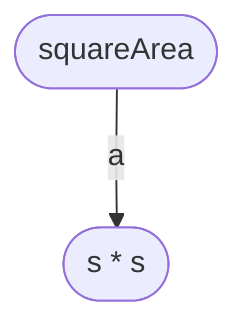
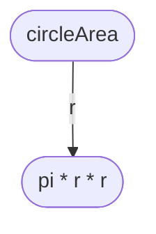
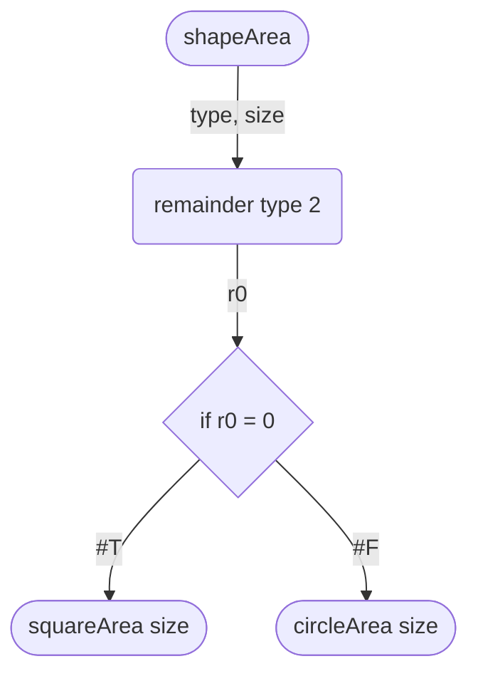

### isMultiple

```mermaid
flowchart TD;
    id0([isMultiple]) -- n, m --> id1(remainder n m);
    id1 -- r0 --> id2([r0 = 0]);
```

### squareArea

```mermaid
flowchart TD;
    id0([squareArea]) -- a --> id1([s * s]);
```

### circleArea

```mermaid
flowchart TD;
    id0([circleArea]) -- r --> id1([pi * r * r]);
```

### shapeArea

```mermaid
flowchart TD;
    id0([shapeArea]) -- type, size --> id1(remainder type 2);
    id1 -- r0 --> id2{if r0 = 0};
    id2 -- #T --> id3([squareArea size]);
    id2 -- #F --> id4([circleArea size]);
```
